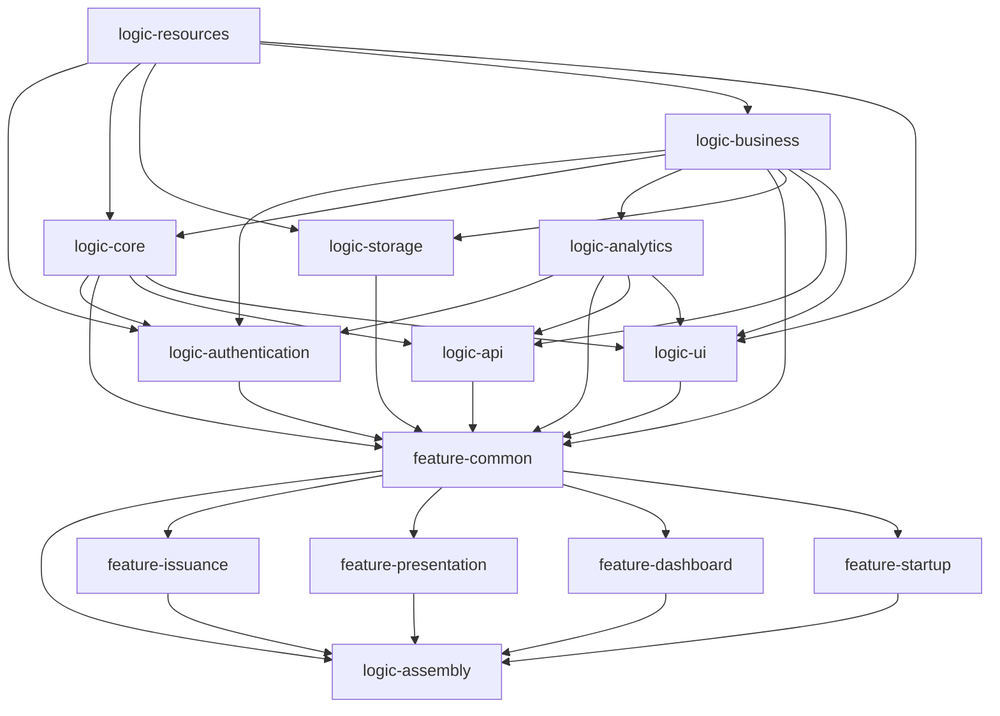

# Age Verification iOS App

## Table of contents

* [Overview](#overview)
* [Specifications Employed](#-specifications-employed)
* [Important note](#important-note)
* [How to use the application](#how-to-use-the-application)
* [Quick start guide](#quick-start-guide)
* [Application configuration](#application-configuration)
* [How to contribute](#how-to-contribute)
* [License](#license)

## Overview

The Age Verification (AV) iOS app is part of the Age Verification Solution Toolbox and serves as a component that can be used by Member States, if necessary, to develop a national solution and build upon the building blocks of the toolbox.

This iOS app is forked from the [EUDI iOS Wallet reference application](https://github.com/eu-digital-identity-wallet/eudi-app-ios-wallet-ui), which is built based on the [Architecture Reference Framework](https://github.com/eu-digital-identity-wallet/eudi-doc-architecture-and-reference-framework/blob/main/docs/architecture-and-reference-framework-main.md) and aims to showcase a robust and interoperable platform for digital identification, authentication, and electronic signatures based on common standards across the European Union.

The AV iOS Implementation is based on a modular architecture composed of business-agnostic, reusable components that will evolve in incremental steps and can be re-used across multiple projects.

The AV iOS app allows users to:

1. Obtain, store, and present an age verification attestation.
2. Share the proof of age attestation with online services to gain access.

For a guided walkthrough of the demo — installation, issuing an age proof, and presenting it to a verifier — see the official [Age Verification Blueprint documentation](https://ageverification.dev/Getting%20started/app_installation/).
 
## 💡 Specifications Employed

The app consumes the SDK called EUDIW Wallet core [Wallet kit](https://github.com/eu-digital-identity-wallet/eudi-lib-ios-wallet-kit) and a list of available libraries to facilitate remote presentation and issuing test/demo functionality following partially the specification of the [ARF](https://github.com/eu-digital-identity-wallet/eudi-doc-architecture-and-reference-framework), including:

- OpenID4VP v1 (remote presentation), DCQL

- OpenID4VCI v1 (issuing)

- Digital Credentials API (DC API) for browser-based presentation

- Zero-Knowledge Proofs (ZKP) for privacy-preserving age predicates
 
> [!IMPORTANT]
> This application implements the **Age Verification (AV) profile**. The generic EUDI Wallet issuer (`issuer.eudiw.dev`) and verifier (`verifier.eudiw.dev`) do **not** support the AV profile and will not work with this app — do not use them for testing.

For the Age Verification issuer and verifier services used to obtain and present age verification credentials, refer to the official [Age Verification Blueprint documentation](https://ageverification.dev/Getting%20started/app_installation/).

## Important note

This white-label application is a reference implementation of the Age Verification solution that should be customised before publishing it.
The open-source blueprint gives you a working foundation, but it does not cover everything needed for a production deployment. Before going live, a number of technical tasks must be completed by the implementer — covering areas such as app hardening, secure storage, issuer setup, key management, issuance flow security, document-based enrolment, user authentication, and localisation.

A full description of each task is provided in the [Implementer Checklist](https://ageverification.dev/Getting%20started/app_implementers_tasks/).
Note that this checklist covers technical tasks only. Legal compliance, governance agreements, issuer registration on the AV Trusted List, and enrolment method validation are equally important and must be addressed in parallel.

Please note that this application is still under active development. It is regularly updated and new features and improvements are continuously being added.

If you're planning to use this application in production, we also recommend reviewing the following steps:
- Configure the application properly by following the guide [here](wiki/configuration.md)
- The Pin storage configuration matches your security requirements, or provide your own by following this guide [Pin Storage Configuration](wiki/configuration.md#pin-storage-configuration)
- To enhance security, it is strongly recommended that the allowed PINs raise the overall security level. Sequential or easily guessable patterns (such as "135246 or "147258") should not be permitted. Additionally, it is advisable to check against a list of the most commonly used or "pwned" PINs to prevent users from choosing weak credentials.
- The application meets the OWASP MASVS industry standard. Please refer to the following links for further information on the controls you must implement to ensure maximum compliance:
    - [OWASP MASVS](https://mas.owasp.org/MASVS/)
- Review the [Production Hardening Guide](./docs/production-hardening-guide-v3.8.md) — mobile security considerations for taking the reference app toward production distribution: app integrity, secure storage, certificate pinning, release signing and runtime protection.

## How to use the application

Minimum device requirements

- Any device that supports iOS 26.2

### Prerequisites

To complete the flows described below, you must build and run the application with Xcode.

### App launch

1. Launch the application
2. You will be presented with a welcome screen where you will be asked to create a PIN for future logins.

### Issuance and presentation

To test the app, there is an issuer and verifier service available online. This allows you to perform the enrollment directly from within the app or via the online issuer in order to receive a proof of age attestation. With the verifier, you can then present this attestation.

A step-by-step guide covering installation, issuing and presenting a proof of age attestation using the online test/demo services is available at [Getting started](https://ageverification.dev/Getting%20started/app_installation/).

## Quick start guide

[This document](wiki/how_to_build.md) describes how you can build the application and deploy the issuing and verification services locally.

## Application configuration

You can find instructions on how to configure the application [here](wiki/configuration.md)

## Package structure

*logic-resources*: All app resources reside here (images, etc.)

*logic-core*: Wallet core logic.

*logic-analytics*: Access to analytics providers. Capabilities for test monitoring analytics (i.e., crashes) can be added here (no functionality right now)

*logic-business*: App business logic.

*logic-storage*: Persistent storage cache.

*logic-authentication*: PinStorage and System Biometrics Logic.

*logic-ui*: Common UI components.

*feature-common*: Code that is common to all features.

*feature-dashboard*: The application's main screen.

*feature-startup*: The initial screen of the app.

*feature-presentation*: Online authentication feature.

*feature-issuance*: Document issuance feature.

*logic-assembly*: This module has access to all the above modules and assembles navigation and DI graphs.

*DigitalCredentialProvider*: This module shares a verified information to the requested verifier. 

## How to contribute

We welcome contributions to this project. To ensure that the process is smooth for everyone
involved, follow the guidelines found in [CONTRIBUTING.md](CONTRIBUTING.md).

## License

### License details

Copyright (c) 2025 European Commission

Licensed under the EUPL, Version 1.2 or - as soon they will be approved by the European
Commission - subsequent versions of the EUPL (the "Licence"); You may not use this work
except in compliance with the Licence.

You may obtain a copy of the Licence at:
https://joinup.ec.europa.eu/software/page/eupl

Unless required by applicable law or agreed to in writing, software distributed under 
the Licence is distributed on an "AS IS" basis, WITHOUT WARRANTIES OR CONDITIONS OF 
ANY KIND, either express or implied. See the Licence for the specific language 
governing permissions and limitations under the Licence.
